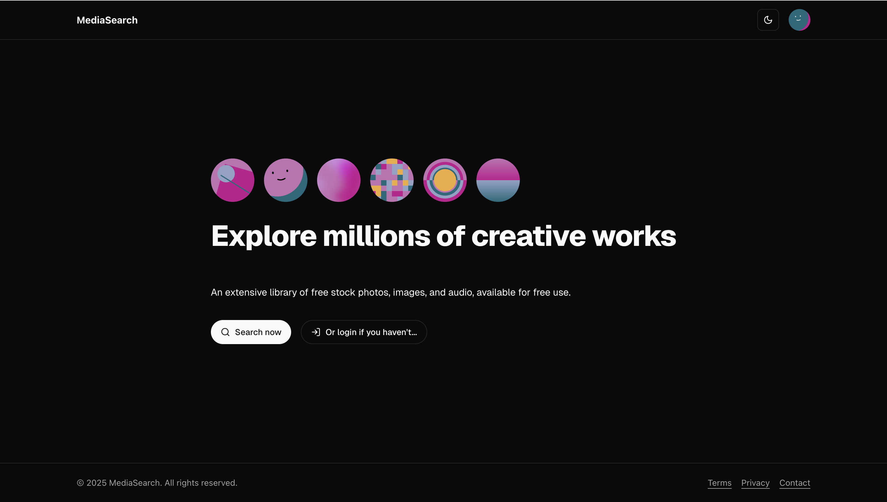
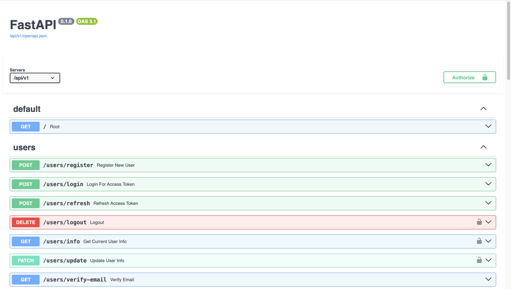

# Open-license media search

This project is part of my Software Engineering module (CMP-9134) at the University of Lincoln. It is a web application that enables authenticated users to search for open-license media, including images, audio, and songs. The platform provides an intuitive interface for discovering and accessing media content with proper licensing information.

## Features

### User Account Management

- User registration and authentication
- Email verification to ensure account security
- Secure handling of user data
- Update user profile (change name, email, and password)
- Password recovery (forgot password)
- Manage search history (save, retrieve, and delete recent searches)

### Media Search & Browsing

- Search for openly licensed media, including images and audio
- Integration with the **Openverse API** for media retrieval
- Advanced search with filtering options
- Graphical user interface for browsing search results
- View detailed media information, including licensing details

### Media Preview & Playback

- Preview images directly in the app
- Play audio files within the interface

## Installation

### Prerequisites

Before setting up the project, ensure you have the following:

- **Docker** installed on your local machine – Follow this [guide](https://docs.docker.com/engine/install/) to install Docker.
- **Openverse API credentials** – Register and retrieve your API key from [Openverse](https://api.openverse.org/v1/#tag/auth/operation/register).
- **SendGrid API key** – Sign up for a [SendGrid account](https://signup.sendgrid.com/) to obtain an API key.
- **Azure credentials** _(optional, for deployment)_ – If you plan to deploy the website yourself, you can register for Azure's **$100 student free credit** and follow this [tutorial](https://learn.microsoft.com/en-us/cli/azure/azure-cli-sp-tutorial-1?tabs=bash#create-a-service-principal-with-role-and-scope) to retrieve credentials.
- **GitHub repository** _(optional, for CI/CD)_ – If you want to use the CI/CD workflow, fork this repository and configure the necessary variables as described in the **CI/CD setup** section.
- **Docker Hub credentials** _(optional, for custom registry)_ – If you prefer to push Docker images to a private registry, set up a [Docker Hub account](https://hub.docker.com/) and generate access credentials.
- **Custom domain settings** _(optional, for deployment)_ – If deploying with a custom domain, ensure you have domain ownership and configure DNS records accordingly.

### Setup Steps

1. Clone the Repository

Run the following command to clone the project to your local machine:

```
git clone https://github.com/vuchuc789/cmp9134-software-engineering.git
cd cmp9134-software-engineering
```

2. Configure Environment Variables

Make copies of the `.env` files and populate them with your credentials as mentioned in the **Prerequisites** section:

```
cp api/.env.example api/.env
cp app/.env.example app/.env
```

3. Start the Local PostgreSQL Database

Navigate to the `api` directory and start the PostgreSQL database using Docker:

```
cd api
docker compose up -d
```

4. Run the API and Web App Locally

Open **two separate terminals** and run the following commands:

#### Terminal 1: Start the API

```
cd api
python -m app.main
```

#### Terminal 2: Start the Web App

```
cd app
npm run dev
```

5. Access the Application

- Open `http://localhost:3000` to access the web application.
- Open `http://localhost:8000/docs` to view the API documentation.

## Usage

### Demo Screenshots

Web Application



API Documentation



## License

MIT License
